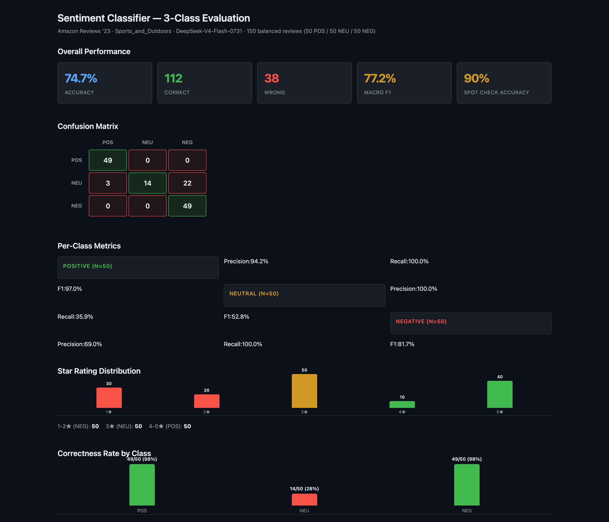

# Hermes Assignment 1 — LLM Binary Sentiment Classifier

A zero-shot binary sentiment classifier for Amazon product reviews. It uses an
LLM via an OpenAI-compatible endpoint to classify each review's **title + text**
as **positive** or **negative**, then scores the predictions against the
star-rating ground truth.

## Preview



The interactive 3-class evaluation dashboard (150 balanced reviews: 50 POS / 50
NEU / 50 NEG), rendered live from
`results/spot_check_3class/dashboard_standalone.html`.

## Data

Source: [Amazon Reviews '23](https://amazon-reviews-2023.github.io) — category
**Sports_and_Outdoors** (19.6M reviews).

Ground-truth labelling (per the assignment):
- rating **>= 4**  → **positive**
- rating **<= 2**  → **negative**
- rating **== 3**  → dropped (ambiguous)

The raw 2.6 GB file is subsampled to a balanced set (default 200 positive +
200 negative) and saved as `data/subsample.jsonl`.

## Files

| File | Purpose |
|------|---------|
| `data_prep.py` | Downloads/streams the raw review file, drops 3-star reviews, labels, and reservoir-samples a balanced subsample. |
| `classifier.py` | Sends each review's title+text to the OpenAI-compatible endpoint, gets POSITIVE/NEGATIVE, and scores against ground truth. |
| `data/subsample.jsonl` | The balanced training/eval subsample (generated). |
| `results/predictions.csv` | One row per review: asin, rating, true label, prediction, raw response. |
| `results/metrics.txt` | Accuracy, per-class precision/recall/F1, confusion matrix. |
| `results/errors.txt` | Reviews where the model returned nothing parseable. |

## Setup (one-time)

```bash
python3 -m venv .venv
./.venv/bin/pip install -r requirements.txt
```

## Build the subsample

```bash
# download+prepare is separate (the raw gz is 2.6 GB, already saved in data/)
./.venv/bin/python data_prep.py \
    --src data/Sports_and_Outdoors.jsonl.gz \
    --out data/subsample.jsonl \
    --pos 200 --neg 200
```

If you only want to peek, a small `--pos 10 --neg 10` run is quick.

## Run the classifier

```bash
# Full run on the subsample
./.venv/bin/python classifier.py --sample data/subsample.jsonl

# Quick test (first 40 reviews)
./.venv/bin/python classifier.py --sample data/subsample.jsonl --max-reviews 40
```

### Endpoint configuration

The classifier resolves its endpoint/model/API key automatically from your
Hermes `~/.hermes/config.yaml` custom provider. To override (e.g. another
OpenAI endpoint), in priority order:

1. CLI flags: `--base-url ... --model ... --api-key ...`
2. Env vars: `OPENAI_BASE_URL`, `OPENAI_MODEL`, `OPENAI_API_KEY`
3. Hermes `config.yaml` (default)

## Dependencies

Installed in `./.venv` (see `requirements.txt`):
- `openai` — OpenAI-compatible client
- `pyyaml` — read Hermes config
- `requests`, `pandas`, `scikit-learn` (available if you extend the pipeline)
